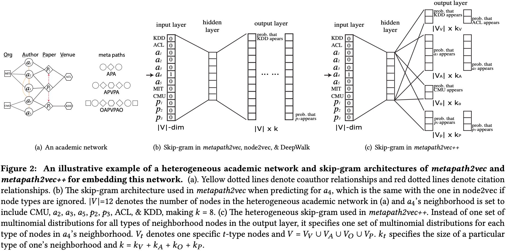

# Metapath2vec

## 介绍
Metapath2vec是一种node2vec向量表示方法. 首次提出了在异构网络上通过元路径游走(metapath)的方式生成游走序列(训练样本)，同word2vec类似以最大化同构边𝑁𝑡(𝑉)下node上下文共现概率为目标，使用skip-gram模型和负采样方式学习损失函数.

## 数据
data
net_train
in_train
out_train
## 使用

