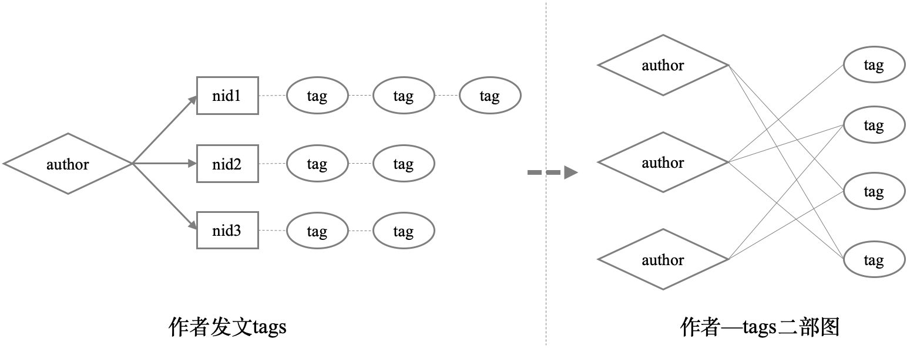

# Metapath2vec介绍

Metapath2vec是一种node2vec向量表示方法. 首次提出了在异构网络上通过元路径游走(metapath)的方式生成游走序列(训练样本)，同word2vec类似以最大化同构边𝑁𝑡(𝑉)下node上下文共现概率为目标，使用skip-gram模型和负采样方式学习损失函数.

<p align="center">
 
</p>

## 数据
源数据：./data/zhengpai_tuwen
<p align="left">
 
</p>

二部图数据：./data/net_train

随机游走序列：./data/in_train

结果向量：./data/out_train

## 使用
```
sh run.sh
```
**构建网络**

通过作者->文章->文章tag数据生成作者&文章tag的二部图(也可以保留文章，学习文章向量)，维护id映射关系、作者到tag和tag到作者两个map数据结构

**随机游走生成序列样本**

通过作者&tag的二部图，以及作者到tag和tag到作者map，随机游走出 author1->tag1->author2->tag2->...->authorn->tagn

**metapath2vec训练**

使用word2vec方式训练产出所有author和tag的向量表示

**相似性测试与评估**

